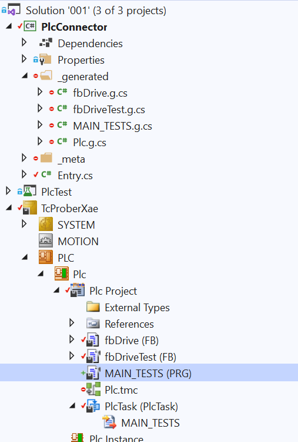
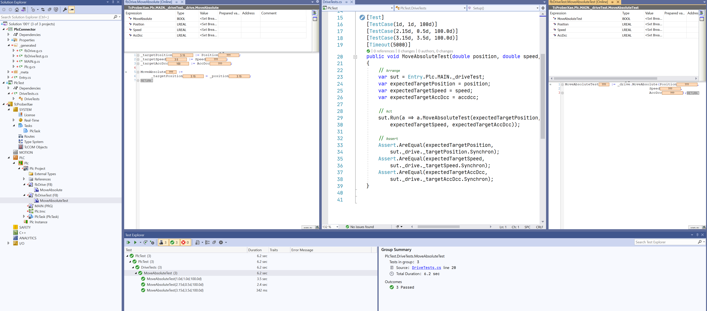

# Tc.Prober

## Brief description

### History

The concept of Tc.Prober was developed and used within [MTS](mts.sk/en) company as a part of the effort to provide high quality, testable components for industrial applications based on [Beckhoff's TwinCAT3](https://infosys.beckhoff.com/english.php?content=../content/1033/tcinfosys3/index.html&id=) platform. Tc.Prober is part of a wider initiative that eventually became [Inxton project](inxton.com).

### What Tc.Prober is

Tc.Prober is a library that in conjunction with [*Inxton.Vortex.Compiler*](https://github.com/Inxton/documentation/blob/master/apis/Inxton.vortex.compiler.console/README.md) (IVC) allows for running unit tests of the TwiCAT3 plc code using well-known unit testing frameworks widely used .net ecosystem.

Tc.Prober takes advantage of some features offered by TwinCAT3 platform that makes it possible to invoke plc methods marked with attribute ```TcRpcEnable``` over ADS from a .net based code.

To make the process faster to implement, we relay on IVC compiler. IVC trans-piles the plc program declarations and methods into so-called [twin-objects](https://github.com/Inxton/documentation/blob/master/apis/Inxton.vortex.compiler.console/Conceptual/TwinObjects.md), these are C# classes mirroring the structure of the plc program. They provide multiple layered access to the plc's data and remotely invocable methods.

Tc.Prober implements [runners](https://github.com/TcOpenGroup/tc.prober#run-test-in-nunit) that provide control over the execution of the code under test. Runner, in other words, is a mechanism emulate plc task from the .net environment.

There is also an implementation of the [runner](https://github.com/TcOpenGroup/tc.prober#test-recording) with test recording capability. This is especially useful when we have the availability of hardware for testing for a limited time. In this way, we can record the behaviour of the hardware when available and re-run the tests with the recorded image later.

So to answer a question of what the Tc.Prober is in short: the library that brings your unit testing iterations to .net testing frameworks of your choice be it xUnit, nUnit, MSUnit.

### What Tc.Prober is not

In contrast to Tc.Unit Tc.Prober does not implement assertions nor executing mechanism directly in the PLC; it relays instead on testing frameworks .net environment.

### How does it work

Following is just a conceptual overview that does not aim to provide a fully working and usable example. In [this GitHub](https://github.com/PTKu/Tc.Prober.Examples) repository, you can find explanatory functional examples. For simplicity, we provide the minimalist way of writing the testing code that does not necessarily represent the best practice.

Let's have a function block with following definition and method implementation:

~~~ PASCAL
FUNCTION_BLOCK fbDrive
VAR
    _position : LREAL;
    _speed : LREAL;
    _acc_dcc : LREAL;

    _targetPosition : LREAL;
    _targetSpeed : LREAL;
    _targetAccDcc : LREAL;
END_VAR
//----------------------------------
METHOD MoveAbsolute : BOOL
VAR_INPUT
    Position : LREAL;
    Speed : LREAL;
    AccDcc : LREAL;
END_VAR
//----------------------------------
_targetPosition := Position;
_targetSpeed := Speed;
_targetAccDcc := AccDcc;

MoveAbsolute := _targetPosition = _position;
//----------------------------------
~~~

This would be the production code that we shall unit test. For simplicity we simulate the position of the drive in ```_position``` variable when ```_position``` and ```_targetPosition``` equal the method returns true; that in this case stands for ```operation done```.

Let's have testing function block that has an instance of ```fbDrive``` block and implements testing method ```MoveAbsoluteTest()``` that invokes fbDrive's MoveAbsolute() method.

~~~ PASCAL
FUNCTION_BLOCK INTERNAL fbDriveTest
VAR
    _drive : fbDrive;
END_VAR
//----------------------------------
{attribute 'TcRpcEnable'}
METHOD INTERNAL MoveAbsoluteTest : BOOL
VAR_INPUT
    Position : LREAL;
    Speed : LREAL;
    AccDcc : LREAL;
END_VAR
//----------------------------------

MoveAbsoluteTest := _drive.MoveAbsolute(Position, Speed, AccDcc);

//----------------------------------
~~~

This would be the part of code that executes the test for our ```fbDrive``` block. The body of the method only calls ```MoveAbsolute``` method.

Here are two things to notice:

* method ```MoveAbsoluteTest``` has ```TcRpcEnable``` attribute. This will tell IVC that we want this method to be invocable from a pc application (whatever that application is, in this case, unit testing).
* the ```fbDriveTest``` and ```MoveAbsoluteTest```  are marked with access modifier ```INTERNAL``` which makes them visible only within the project where it is declared. In this way, we render the testing blocks invisible to any external consumer of our library. (If you are trying to make a project from scratch and need to access internals in testing a project you'll need to add [InternalsVisibleTo](https://docs.microsoft.com/en-us/dotnet/api/system.runtime.compilerservices.internalsvisibletoattribute?view=netframework-4.8) assembly attribute, [see also here](https://github.com/PTKu/Tc.Prober.Examples/blob/main/src/001/PlcConnector/Properties/AssemblyInfo.cs))

Now. In order to instantiate our testing block let's have ```MAIN_TESTS``` block that will hold the instance of the testing function block. The program ```MAIN_TESTS``` must be assigned to a ```Plc Task``` for ```ADS``` symbols are created.

~~~ PASCAL
PROGRAM INTERNAL MAIN_TESTS
VAR
    _driveTest : fbDriveTests;
END_VAR
//----------------------------------
~~~

At this point, we have our plc code ready. We will need now to run IVC to make the plc program available to our unit testing project. There are two ways we can run the IVC running [IVC CLI](https://github.com/Inxton/documentation/blob/master/apis/Inxton.vortex.compiler.console/README.md#command-line-interface-cli) or install [VS extension](https://marketplace.visualstudio.com/items?itemName=Inxton.InxtonVortexBuilderExtensionPre).

If you are trying to make the project from scratch, then you should go [here](https://github.com/Inxton/documentation) to understand the basics of Inxton.Vortex.Framework (IVF).

Once we have successfully run the IVC, we will get .net twin (PlcConnector) of our plc project that will allow us to access the plc program from .net environment.



~~~ CSharp
using Tc.Prober.Runners;
public class DriveTests
{
        [Test]
        [TestCase(1d, 1d, 100d)]            // Test cases
        [TestCase(2.15d, 0.5d, 100.0d)]
        [TestCase(3.15d, 3.5d, 100.0d)]
        [Timeout(5000)]                     // Timeout for the test if the test does not complete within given time it will fail.
        public void MoveAbsoluteTest(double position, double speed, double accdcc)
        {
            //-- Arrange
            var sut = Entry.Plc.MAIN_TESTS._driveTest; // This just shortens the path to object under test
            // Arrange expected parameters
            var expectedTargetPosition = position;    
            var expectedTargetSpeed = speed;
            var expectedTargetAccDcc = accdcc;

            //-- Act

            // 'Run' is an extension method that will run the action until returns 'true'
                
            sut.Run(a => a.MoveAbsoluteTest(expectedTargetPosition, 
                expectedTargetSpeed, expectedTargetAccDcc));

            // Alternatively
#if ALTERNATIVE           
            sut.Run(a =>
            {
                bool done = a.MoveAbsoluteTest(expectedTargetPosition,
                expectedTargetSpeed, expectedTargetAccDcc);
                return done;
            });
#endif

            //-- Assert

            Assert.AreEqual(expectedTargetPosition, 
                sut._drive._targetPosition.Synchron);
            Assert.AreEqual(expectedTargetSpeed, 
                sut._drive._targetSpeed.Synchron);
            Assert.AreEqual(expectedTargetAccDcc, 
                sut._drive._targetAccDcc.Synchron);
        }
}
~~~

Now we are ready to execute the tests from ```Test explorer```!



### Advantages

* Direct use of well-evolved unit testing frameworks in plc code testing.
* Runners can be in control of the cycle execution. It allows creating complex assertions in single cycles.
* Ability to record the state of the plc structure for later reconstruction of hardware behaviour.

### Disadvantages

* In scenarios when method is executed by runner and not plc task it must be taken into consideration the interaction between hard-real-time and non-real-time environment, in particular when interacting with I/O systems. This may lead to convoluted test design, nasty concurrency and race conditions.
* Whenever the fast execution or low jitter is required, this approach might is not suitable when execution is run exclusively by runners.
* When the execution of test is provided solely by test runner the breakpoints in plc program are not hit.
