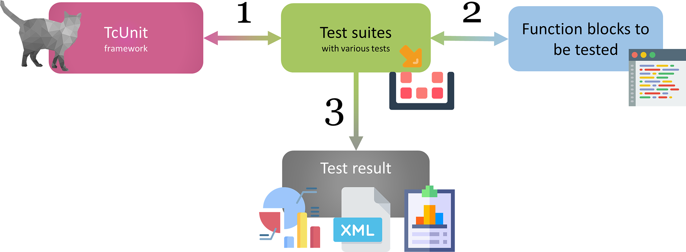
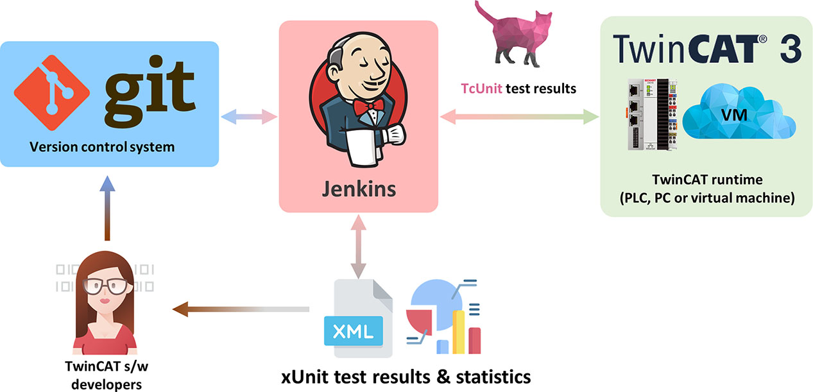
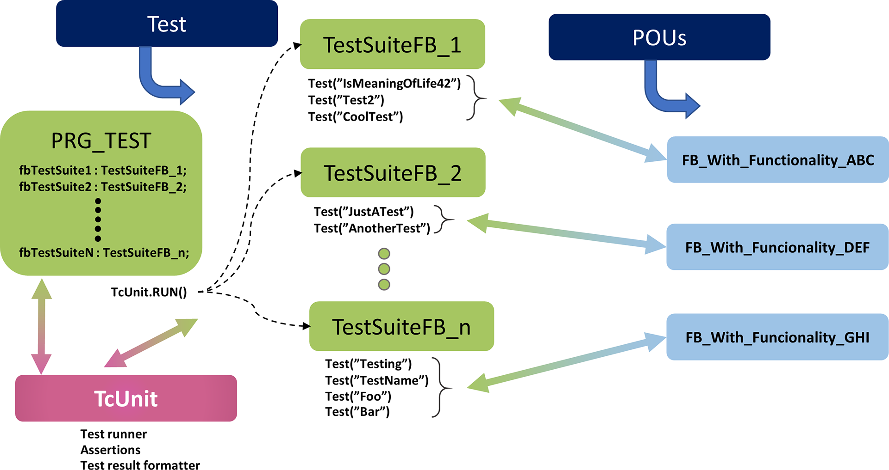
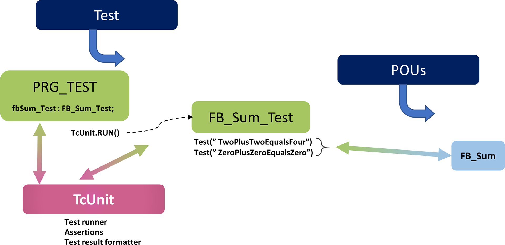
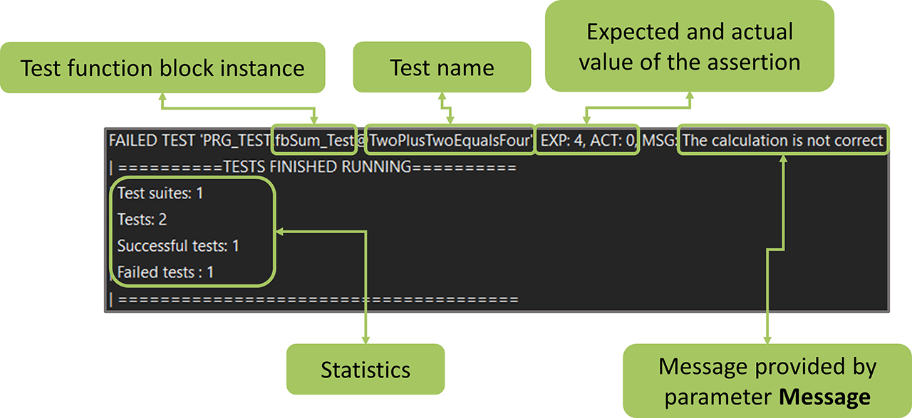
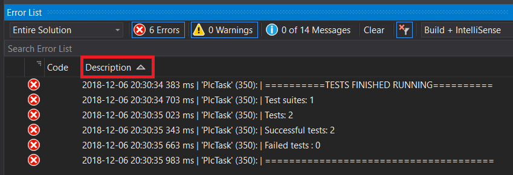

# Tc.Prober

## Brief description

### History

The concept of Tc.Prober was developed and used within [MTS](https://www.mts.sk/en) company as a part of the effort to provide high quality, testable components for industrial applications based on [Beckhoff's TwinCAT3](https://infosys.beckhoff.com/english.php?content=../content/1033/tcinfosys3/index.html&id=) platform. Tc.Prober is part of a wider initiative that eventually became [Inxton project](https://www.inxton.com).

### What Tc.Prober is

Tc.Prober is a library that in conjunction with [*Inxton.Vortex.Compiler*](https://github.com/Inxton/documentation/blob/master/apis/Inxton.vortex.compiler.console/README.md) (IVC) allows for running unit tests of the TwiCAT3 plc code using well-known unit testing frameworks widely used .net ecosystem.

Tc.Prober takes advantage of some features offered by TwinCAT3 platform that makes it possible to invoke plc methods marked with attribute ```TcRpcEnable``` over ADS from a .net based code.

To make the process faster to implement, we relay on IVC compiler. IVC trans-piles the plc program declarations and methods into so-called [twin-objects](https://github.com/Inxton/documentation/blob/master/apis/Inxton.vortex.compiler.console/Conceptual/TwinObjects.md), these are C# classes mirroring the structure of the plc program. They provide multiple layered access to the plc's data and remotely invocable methods.

Tc.Prober implements [runners](https://github.com/TcOpenGroup/tc.prober#run-test-in-nunit) that provide control over the execution of the code under test. Runner, in other words, is a mechanism emulate plc task from the .net environment.

There is also an implementation of the [runner](https://github.com/TcOpenGroup/tc.prober#test-recording) with test recording capability. This is especially useful when we have the availability of hardware for testing for a limited time. In this way, we can record the behaviour of the hardware when available and re-run the tests with the recorded image later.

So to answer a question of what the Tc.Prober is in short: the library that brings your unit testing iterations to .net testing frameworks of your choice be it xUnit, nUnit, MSUnit.

### What Tc.Prober is not

In contrast to TcUnit Tc.Prober does not implement assertions nor executing mechanism directly in the PLC; it relays instead on testing frameworks .net environment.

### How does it work

Following is just a conceptual overview that does not aim to provide a fully working and usable example. In [this GitHub](https://github.com/PTKu/Tc.Prober.Examples) repository, you can find explanatory functional examples. For simplicity, we provide the minimalist way of writing the testing code that does not necessarily represent the best practice.

Let's have a function block with following definition and method implementation:

~~~ PASCAL
FUNCTION_BLOCK fbDrive
VAR
    _position : LREAL;
    _speed : LREAL;
    _acc_dcc : LREAL;

    _targetPosition : LREAL;
    _targetSpeed : LREAL;
    _targetAccDcc : LREAL;
END_VAR
//----------------------------------
METHOD MoveAbsolute : BOOL
VAR_INPUT
    Position : LREAL;
    Speed : LREAL;
    AccDcc : LREAL;
END_VAR
//----------------------------------
_targetPosition := Position;
_targetSpeed := Speed;
_targetAccDcc := AccDcc;

MoveAbsolute := _targetPosition = _position;
//----------------------------------
~~~

This would be the production code that we shall unit test. For simplicity we simulate the position of the drive in ```_position``` variable when ```_position``` and ```_targetPosition``` equal the method returns true; that in this case stands for ```operation done```.

Let's have testing function block that has an instance of ```fbDrive``` block and implements testing method ```MoveAbsoluteTest()``` that invokes fbDrive's MoveAbsolute() method.

~~~ PASCAL
FUNCTION_BLOCK INTERNAL fbDriveTest
VAR
    _drive : fbDrive;
END_VAR
//----------------------------------
{attribute 'TcRpcEnable'}
METHOD INTERNAL MoveAbsoluteTest : BOOL
VAR_INPUT
    Position : LREAL;
    Speed : LREAL;
    AccDcc : LREAL;
END_VAR
//----------------------------------

MoveAbsoluteTest := _drive.MoveAbsolute(Position, Speed, AccDcc);

//----------------------------------
~~~

This would be the part of code that executes the test for our ```fbDrive``` block. The body of the method only calls ```MoveAbsolute``` method.

Here are two things to notice:

* method ```MoveAbsoluteTest``` has ```TcRpcEnable``` attribute. This will tell IVC that we want this method to be invocable from a pc application (whatever that application is, in this case, unit testing).
* the ```fbDriveTest``` and ```MoveAbsoluteTest```  are marked with access modifier ```INTERNAL``` which makes them visible only within the project where it is declared. In this way, we render the testing blocks invisible to any external consumer of our library. (If you are trying to make a project from scratch and need to access internals in testing a project you'll need to add [InternalsVisibleTo](https://docs.microsoft.com/en-us/dotnet/api/system.runtime.compilerservices.internalsvisibletoattribute?view=netframework-4.8) assembly attribute, [see also here](https://github.com/PTKu/Tc.Prober.Examples/blob/main/src/001/PlcConnector/Properties/AssemblyInfo.cs))

Now. In order to instantiate our testing block let's have ```MAIN_TESTS``` block that will hold the instance of the testing function block. The program ```MAIN_TESTS``` must be assigned to a ```Plc Task``` for ```ADS``` symbols are created.

~~~ PASCAL
PROGRAM INTERNAL MAIN_TESTS
VAR
    _driveTest : fbDriveTests;
END_VAR
//----------------------------------
~~~

At this point, we have our plc code ready. We will need now to run IVC to make the plc program available to our unit testing project. There are two ways we can run the IVC running [IVC CLI](https://github.com/Inxton/documentation/blob/master/apis/Inxton.vortex.compiler.console/README.md#command-line-interface-cli) or install [VS extension](https://marketplace.visualstudio.com/items?itemName=Inxton.InxtonVortexBuilderExtensionPre).

If you are trying to make the project from scratch, then you should go [here](https://github.com/Inxton/documentation) to understand the basics of Inxton.Vortex.Framework (IVF).

Once we have successfully run the IVC, we will get .net twin (PlcConnector) of our plc project that will allow us to access the plc program from .net environment.


~~~ CSharp
using Tc.Prober.Runners;
public class DriveTests
{
        [Test]
        [TestCase(1d, 1d, 100d)]            // Test cases
        [TestCase(2.15d, 0.5d, 100.0d)]
        [TestCase(3.15d, 3.5d, 100.0d)]
        [Timeout(5000)]                     // Timeout for the test if the test does not complete within given time it will fail.
        public void MoveAbsoluteTest(double position, double speed, double accdcc)
        {
            //-- Arrange
            var sut = Entry.Plc.MAIN_TESTS._driveTest; // This just shortens the path to object under test
            // Arrange expected parameters
            var expectedTargetPosition = position;    
            var expectedTargetSpeed = speed;
            var expectedTargetAccDcc = accdcc;

            //-- Act

            // 'Run' is an extension method that will run the action until returns 'true'
                
            sut.Run(a => a.MoveAbsoluteTest(expectedTargetPosition, 
                expectedTargetSpeed, expectedTargetAccDcc));

            // Alternatively
#if ALTERNATIVE           
            sut.Run(a =>
            {
                bool done = a.MoveAbsoluteTest(expectedTargetPosition,
                expectedTargetSpeed, expectedTargetAccDcc);
                return done;
            });
#endif

            //-- Assert

            Assert.AreEqual(expectedTargetPosition, 
                sut._drive._targetPosition.Synchron);
            Assert.AreEqual(expectedTargetSpeed, 
                sut._drive._targetSpeed.Synchron);
            Assert.AreEqual(expectedTargetAccDcc, 
                sut._drive._targetAccDcc.Synchron);
        }
}
~~~

Now we are ready to execute the tests from ```Test explorer```!


### Advantages

* Direct use of well-evolved unit testing frameworks in plc code testing.
* Runners can be in control of the cycle execution. It allows creating complex assertions in single cycles.
* Ability to record the state of the plc structure for later reconstruction of hardware behaviour.

### Disadvantages

* In scenarios when method is executed by runner and not plc task it must be taken into consideration the interaction between hard-real-time and non-real-time environment, in particular when interacting with I/O systems. This may lead to convoluted test design, nasty concurrency and race conditions.
* Whenever the fast execution or low jitter is required, this approach might is not suitable when execution is run exclusively by runners.
* When the execution of test is provided solely by test runner the breakpoints in plc program are not hit.

# TcUnit

## Brief description  

[TcUnit](https://www.tcunit.org) is an [xUnit](https://en.wikipedia.org/wiki/XUnit) type of framework specifically done for Beckhoffs TwinCAT 3 development environment. It consists of a single library that is easily integrated into any existing TwinCAT 3 project. It is an open-source framework using the open and permissive [MIT-license](https://opensource.org/licenses/MIT).    
  


The framework consists of a single library that can be easily integrated into any TwinCAT 3 PLC project. The tests can be executed either locally or as part of a CI/CD toolchain with the aid of [TcUnit-Runner](https://github.com/tcunit/TcUnit-Runner).  


The official web page for the project is available at **[www.tcunit.org](https://www.tcunit.org)**.

## How does it work
What follows is a very simple example. For more elaborate examples, visit [this](https://tcunit.org/programming-example-introduction/) (TcUnit official advanced example) and [this](https://github.com/tcunit/ExampleProjects) (GitHub example projects) website.
The general concept is that you write one or several so called **test suites** for every function block (or function) that you want to write tests for.

The general structure here is that `PRG_TEST` is the program in where the test-FBs (test suites) are instantiated. Each test suite is responsible of testing one FB or function, and can have one or more **tests** to do so.

Let’s assume we want to create the simplest possible FB that takes two unsigned integers and sums them. We can create the header for the FB, but the actual implementation can (and should) wait after we’ve done the unit tests.
~~~ PASCAL
FUNCTION_BLOCK FB_Sum
VAR_INPUT
    one : UINT;
    two : UINT;
END_VAR
VAR_OUTPUT
    result : UINT;
END_VAR
~~~

Now let’s create the test suite for this. This FB needs to extend `TcUnit.FB_TestSuite`  

~~~ PASCAL
FUNCTION_BLOCK FB_Sum_Test EXTENDS TcUnit.FB_TestSuite
VAR
END_VAR
~~~

By always adding this code, your test suite gets access to TcUnit and TcUnit will have a handle to your test suites.
Now it’s time to create our tests. There are many ways to structure your tests, and there are [several guidelines](http://fluxens.com/unittesting.html) for this as well. What we’ll be doing is to create a method for every test, and name it in such a way that it’s clear what the test does. Remember that the unit tests are part of the documentation of your code, and although you might find the code trivial at this moment, there might be other developers reading your code now (or many years in the future). For them well-named tests are invaluable. We’ll be creating two tests called `TwoPlusTwoEqualsFour` and `ZeroPlusZeroEqualsZero`. The `TwoPlusTwoEqualsFour` will look like this:

~~~ PASCAL
METHOD TwoPlusTwoEqualsFour
VAR
    Sum : FB_Sum;
    Result : UINT;
    ExpectedSum : UINT := 4;
END_VAR
----------------------------------------------------------
TEST('TwoPlusTwoEqualsFour');
 
Sum(one := 2, two := 2, result => Result);
 
AssertEquals(Expected := ExpectedSum,
             Actual := Result,
             Message := 'The calculation is not correct');
 
TEST_FINISHED();
~~~

By calling `TEST()` we tell TcUnit that everything that follows is a test. Remember that we did `EXTEND FB_TestSuite` in our test-suite? This gives us access to assert-methods to check for all the data types available in IEC61131-3, including the `ANY`-type. The Message parameter is optional and is used in case the assertion fails, the text is appended to the error output. We finish the method by calling `TEST_FINISHED()`. This gives the flexibility to have tests that span over more than one PLC-cycle.

For `ZeroPlusZeroEqualsZero` it’s more or less the same code.

~~~ PASCAL
METHOD ZeroPlusZeroEqualsZero
VAR
    Sum : FB_Sum;
    Result : UINT;
    ExpectedSum : UINT := 0;
END_VAR
----------------------------------------------------------
TEST('ZeroPlusZeroEqualsZero');
 
Sum(one := 0, two := 0, result => Result);
 
AssertEquals(Expected := ExpectedSum,
             Actual := Result,
             Message := 'The calculation is not correct');
 
TEST_FINISHED();
~~~

Next we need to update the body of the test suite (`FB_Sum_Test`) to make sure these two tests are being run.

~~~ PASCAL
TwoPlusTwoEqualsFour();
ZeroPlusZeroEqualsZero();
~~~

Last but not least, we need to have a program `PRG_TEST` defined in a task that we can run locally on our engineering PC. Note that this program is only created to run the unit-tests, but will never be run on the target PLC. Being part of the library project we only want a convenient way to test all the FBs part of our library, and thus need this program to execute the test suites.

`PRG_TEST` needs to instantiate all the test suites, and only execute one line of code. In this case we only have one test suite.

~~~ PASCAL
PROGRAM PRG_TEST
VAR
    fbSum_Test : FB_Sum_Test; // This is our test suite
END_VAR
-----------------------------
TcUnit.RUN();
~~~
What we have now is this:  



Activating this solution and running it results in the following result in the visual studio error list:



There is one test that has failed, and the reason for this is that we have not written the implementation code yet, only the header of the function block `FB_Sum`. But how come that we have one test succeeding? As we can see, the test `TwoPlusTwoEqualsFour` failed, which means that the one that succeeded was the other test `ZeroPlusZeroEqualsZero`. The reason this succeeds is that the default return value for an output-parameter is zero, and thus it means that even if we haven’t written the body of `FB_Sum` the test will succeed. Let’s finish by implementing the body of `FB_Sum`.

~~~ PASCAL
FUNCTION_BLOCK FB_Sum
VAR_INPUT
    one : UINT;
    two : UINT;
END_VAR
VAR_OUTPUT
    result : UINT;
END_VAR
--------------------
result := one + two;
~~~
Activating this solution and running it results in the following result in the visual studio error list:  


## Advantages

* **Easy to use** - All functionality is provided by one single library. All that is needed is to download & install the library, and provide a reference to the TcUnit-library in your project, and you can start to write your test code.
* **MIT-license** - The library and all the source code is licensed according to the [MIT-license](https://opensource.org/licenses/MIT), which is one of the most permissive software license terms. The software is completely free and you can use the software in any way you want, be it private or for commercial use as long as you include the MIT license terms with your software.
* **Automated test runs** - With the additional [TcUnit-Runner software](https://github.com/tcunit/TcUnit-Runner), it’s possible to do integrate all your TcUnit tests into a CI/CD software toolchain. With the aid of Jenkins (or any other automation software), you can have your tests being run automatically and collect test statistics every time something is changed in your software version control (such as Git or Subversion). If you want to know more, read the [documentation for TcUnit-Runner](https://tcunit.org/tcunit-runner-user-manual/).
* **Runs in PLC** - All tests are run in a PLC-environment, so that real-time behaviour can also be tested

## Disadvantages

* **Requires to learn a new framework** -  If you are already used to standard "IT" frameworks such as JUnit, NUnit or Googletest then TcUnit will feel similar, but it's an additional framework to learn
* **Runs in PLC** - Can get a little bit time consuming to run the tests if you need to activate configuration, start TwinCAT etc