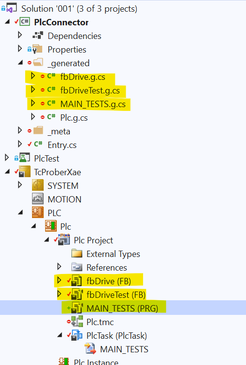

# Unit testing in the world of industrial automation

This is a joint article by Jakob Sagatowski and Peter Kurhajec.

Unit testing is the practice of writing a test for some required functionality.
In the world of "classical" IT software development the concept of unit testing has been around for almost two decades.
What is a standard procedure in languages such as Java, C++, .NET/C# and Python has been completely lacking in the world of PLCs. The world of automation did neither have proper tools nor did develop any comprehensive automated testing frameworks. Here we present two possible approaches for unit testing in Beckhoff's TwinCAT 3.

## Are there ways of testing software in TwinCAT 3?

Yes! We are all testing our programs with (almost) every iteration we do.
However, the common procedure for PLC developers and the world of industrial automation
in general is to only test the code once we are at the machine on the acceptance level.
However, those tests are only executed and validated at the moment of that particular iteration.
As soon as the program is modified, we can no longer be sure that the functionality
has not been compromised. The later in the development cycle we discover a bug in the software, 
the more expensive it is to fix. << **TODO:** PETER WILL INCLUDE A REFERENCE TO A STUDY ABOUT THIS HERE>>.


When doing software development, what usually happens when the code base grows
is that it gets harder to change the code base as the developer gets scared that 
some existing functionality might get broken. One of the properties with 
unit tests is that you suddenly have a **regression test suite** of your code. 
If you find it necessary to do any changes to the software
(for instance, by refactoring or if you want to add functionality), 
you have all the tests which you easily can re-run. 
This increases the programmer’s **confidence** in making larger architectural 
changes when adding new functionality. Once you’ve written tests for a time, 
it gets natural to test small sets of functionalities at a time, and thus your 
function blocks usually end up quite small. Unit testing thus leads to more 
**modularized**, **extensible**, and **flexible code**. 
When defining the tests, you’ll automatically define what the function blocks 
under tests should provide, and thus you’ll end up with clear defined interfaces
for the function blocks. The unit tests shouldn’t just be software for validating
the application, but is equally much a mental engine for the design of the software.

As you’re writing test cases, you get better test code coverage and thus **fewer bugs**.
As your test cases are written, you come up with scenarios and run your code that
you normally wouldn’t run under normal test circumstances.
Any developer that is going to look at your code will get **documentation** of what the code is supposed to do looking at the test cases. The test cases dictate what outputs every function block should provide given a set of inputs. With this information, any developer that looks at the test cases gets a better understanding of what the function block is supposed to do, so the test cases become examples of what the code should do. When developing a certain set of functionalities, you need to define what that functionality is supposed to provide. With unit test cases, this is exactly what we are doing and thus these become **acceptance criteria**. As every test case that you are writing is for a single piece of functionality, you will have to think what interfaces that functionality needs to provide for the rest of the code to be integrated. Only the interfaces for the tests need to be defined. All the other methods and inner workings of the implementing code can be made private! This will result in **tidier code**.

Once the tests pass, you’ll sense a feeling of accomplishment knowing your code passes the tests. 
When you work in a larger project and have thousands of tests that are to be executed, 
it’s a nice feeling to have all the tests pass OK!
Starting with unit testing in the beginning will feel like you must double the effort,
as you now not only need to write the code itself but also the test cases for them.
First off, what you’re doing is saving time that you will later have to spend
fixing all the bugs. Second, when you’ve done this for a while it doesn’t take
so much longer to write some test cases. And on top of that, you get all the
other benefits which are mentioned earlier.
Writing tests costs time, but overall development takes less time.

# Two unit testing frameworks for TwinCAT 3

What follows are two approaches for unit testing in TwinCAT 3.

1. Tc.Prober
1. TcUnit

We will give a brief description of each unit testing framework, and also provide a simple example of each.

## Tc.Prober

### Brief description

#### History

The concept of Tc.Prober was first developed and used within a company
called [MTS](https://www.mts.sk/en),  as part of the effort to provide
high quality, testable components, for industrial applications based
on [Beckhoff\'s TwinCAT
3](https://infosys.beckhoff.com/english.php?content=../content/1033/tcinfosys3/index.html&id=) platform.
Tc.Prober is part of a wider initiative that eventually became the
[Inxton project](https://www.inxton.com/).

#### What is Tc.Prober? 

Tc.Prober is a library that, in conjunction with
the *Inxton.Vortex.Compiler* (IVC), allows for the administration of
unit tests of TwinCAT 3 PLC code *---* using well-known unit testing
frameworks widely utilised in the .NET ecosystem.

Tc.Prober takes advantage of some features offered by the TwinCAT 3
platform, which makes it possible to invoke PLC methods marked with the
attribute TcRpcEnable over ADS from a .NET based code.

To make the process faster to implement, it relies on the IVC compiler.
IVC transpiles the PLC program declarations and methods into
so-called [twin-objects](https://github.com/Inxton/documentation/blob/master/apis/Inxton.vortex.compiler.console/Conceptual/TwinObjects.md),
these are actually C\# classes mirroring the structure of the PLC
program, which provide multiple layered access to the PLC\'s data, and
allow for remotely invocable methods.

Tc.Prober
implements [runners](https://github.com/TcOpenGroup/tc.prober#run-test-in-nunit) that
provide control over the execution of the code undergoing the test. A
runner, in other words, is a mechanism that emulates the PLC task from
the .NET environment.

There is also the implementation of
a [runner](https://github.com/TcOpenGroup/tc.prober#test-recording) with
test recording capability. This is especially useful when we only have
the hardware available for testing for a limited time. In this way, we
can record the behaviour of the hardware when it is available, and
re-run the tests with the recorded image later.

So, to answer the question of what the Tc.Prober is in short: the
library that brings your unit testing iterations to a .NET testing
framework~~s~~ of your choice *---* be it xUnit, nUnit, or even MSUnit.

#### How does it work?

What follows is merely a conceptual overview, which does not aim to
provide a fully functional and usable example. In [this
GitHub](https://github.com/PTKu/Tc.Prober.Examples) repository, you can
find explanatory and practicable examples. For simplicity, we provide
the minimalist way of writing test code --- albeit a style that does not
necessarily represent the best practice.

Let\'s have a function block with the following definition and method
implementation:

~~~ PASCAL
FUNCTION_BLOCK fbDrive
VAR
    _position : LREAL;
    _speed : LREAL;
    _acc_dcc : LREAL;

    _targetPosition : LREAL;
    _targetSpeed : LREAL;
    _targetAccDcc : LREAL;
END_VAR
//----------------------------------
METHOD MoveAbsolute : BOOL
VAR_INPUT
    Position : LREAL;
    Speed : LREAL;
    AccDcc : LREAL;
END_VAR
//----------------------------------
_targetPosition := Position;
_targetSpeed := Speed;
_targetAccDcc := AccDcc;

MoveAbsolute := _targetPosition = _position;
//----------------------------------
~~~

This will be the production code that we shall unit test. For
simplicity, we simulate the position of the drive in
the \_position variable, and when \_position and \_targetPosition are
equal the method returns true; which in this case, stands for operation
done.

Let\'s have a testing function block that has an instance
of fbDrive block and implements the testing method MoveAbsoluteTest(),
which invokes fbDrive\'s MoveAbsolute() method.


~~~ PASCAL
FUNCTION_BLOCK INTERNAL fbDriveTest
VAR
    _drive : fbDrive;
END_VAR
//----------------------------------
{attribute 'TcRpcEnable'}
METHOD INTERNAL MoveAbsoluteTest : BOOL
VAR_INPUT
    Position : LREAL;
    Speed : LREAL;
    AccDcc : LREAL;
END_VAR
//----------------------------------

MoveAbsoluteTest := _drive.MoveAbsolute(Position, Speed, AccDcc);

//----------------------------------
~~~

This would be the part of the code that executes the test for
our fbDrive block. The body of the method only calls
the MoveAbsolute method.

Here are two things to notice:

-   Method MoveAbsoluteTest has a TcRpcEnable attribute. This will tell
    IVC that we want this method to be invocable from a PC application
    (whatever that application is, in this case, unit testing).

-   the fbDriveTest and MoveAbsoluteTest are marked with the access
    modifier INTERNAL which makes them visible only within the project
    where they are declared. In this way, we render the testing blocks
    invisible to any external consumer of our library. If you are trying
    to make a project from scratch, and need to access internals in
    testing a project; you\'ll need to add InternalsVisibleTo the
    assembly attribute, [see also
    here](https://github.com/PTKu/Tc.Prober.Examples/blob/main/src/001/PlcConnector/Properties/AssemblyInfo.cs).

Now. In order to instantiate our testing block, let\'s have
a MAIN_TESTS program that will hold the instance of the testing function
block. The program MAIN_TESTS must be assigned to a PLC
Task for ADS symbols to be created.


~~~ PASCAL
PROGRAM INTERNAL MAIN_TESTS
VAR
    _driveTest : fbDriveTests;
END_VAR
//----------------------------------
~~~

At this point, we have our PLC code ready. We will now need to run IVC
to make the PLC program available to our unit testing project. There are
two ways we can run the IVC; running [IVC
CLI](https://github.com/Inxton/documentation/blob/master/apis/Inxton.vortex.compiler.console/README.md#command-line-interface-cli) or
we can install [VS
extension](https://marketplace.visualstudio.com/items?itemName=Inxton.InxtonVortexBuilderExtensionPre).

If you are trying to make the project from scratch, then you should
go [here](https://github.com/Inxton/documentation) to understand the
basics of the Inxton.Vortex.Framework (IVF).

Once we have successfully run the IVC, we will get the .NET twin
(PlcConnector project), which is the mirror of the PLC program that will
allow us to access it from the .NET environment.



Now we are ready to perform the test using a testing framework. In this
instance, we will use nUnit --- however, any other framework can be
used. In the following example, we have the testing
method MoveAbsoluteTest_dotnet_method.

This method has a series of attributes.  The Test attribute indicates to
nUnit that this method should be explored, and able to be executed by
the testing runner. TestCase attributes run this method with a different
set of parameters position speed and accdcc.  The Timeout attribute
indicates that the test should run within five seconds before it fails
with a time out.

Let\'s dive into the body of the method. The first thing to observe is
the variable subjectUnderTest that is the representation of our testing
function block fbDriveTest.  Entry.Plc.MAIN_TEST.\_driveTest is the .NET
replica twin of the given function block and subjectUnderTest is just a
shortened access variable for the sake of convenience.

Next, we set a series of variables that will hold the expected values
for the assertion later in the test.

At this point, we are ready to execute the actual PLC
method MoveAbsoluteTest. In this case we use Tc.Prober\'s runner, which
is an extension method of any object that is produced
by IVC AKA IVortexObject. If you are unfamiliar with Lambda expressions
you just read subjectUnderTest.Run a(which is the subject under test)
go~~es~~? to =\> the right side of the Lambda expression. Even in more
simplistic terms you can, in this instance, just consider a to be
our subjectUnderTest so that we can invoke the
call a.MoveAbsoluteTest(position, speed, accdcc). This call actually
executes the method inside the PLC any number of times until the method
return is true.

Now we will make assertions to check that the run of the method produced
the expected results. In this case, we just check that the variables
inside the PLC hold the expected values.

~~~ CSharp
using Tc.Prober.Runners;
public class DriveTests
{
        [Test]
        [TestCase(1d, 1d, 100d)]            // Test cases
        [TestCase(2.15d, 0.5d, 100.0d)]
        [TestCase(3.15d, 3.5d, 100.0d)]
        [Timeout(5000)]                     // Timeout for the test if the test does not complete within given time it will fail.
        public void MoveAbsoluteTest_dotnet_method(double position, double speed, double accdcc)
        {
            //-- Arrange
            var subjectUnderTest = Entry.Plc.MAIN_TESTS._driveTest; // This just shortens the path to object under test
            // Arrange expected parameters
            var expectedTargetPosition = position;    
            var expectedTargetSpeed = speed;
            var expectedTargetAccDcc = accdcc;

            //-- Act

            // 'Run' is an extension method that will run the action until returns 'true'
                
            subjectUnderTest.Run(a => a.MoveAbsoluteTest(expectedTargetPosition, 
                expectedTargetSpeed, expectedTargetAccDcc));

            // Alternatively
#if ALTERNATIVE           
            subjectUnderTest.Run(a =>
            {
                bool done = a.MoveAbsoluteTest(expectedTargetPosition,
                expectedTargetSpeed, expectedTargetAccDcc);
                return done;
            });
#endif

            //-- Assert

            Assert.AreEqual(expectedTargetPosition, 
                subjectUnderTest._drive._targetPosition.Synchron);
            Assert.AreEqual(expectedTargetSpeed, 
                subjectUnderTest._drive._targetSpeed.Synchron);
            Assert.AreEqual(expectedTargetAccDcc, 
                subjectUnderTest._drive._targetAccDcc.Synchron);
        }
}
~~~

Now we are ready to execute the tests from ```Test explorer```!


#### Advantages

-   Direct use of well-evolved unit testing frameworks in PLC code
    testing.

-   Runners can be in control of the cycle execution. This allows for
    the creation of complex assertions in single cycles.

-   Ability to record the state of the PLC structure for a post
    reconstruction of hardware behaviour.

#### Disadvantages

-   In scenarios where a method is executed by a runner, and not a PLC
    task, the interaction between hard real-time and non-real-time
    environments must be taken into consideration --- particularly when
    interacting with I/O systems --- as this may lead to a convoluted
    test design, nasty concurrency, and race conditions!

-   Whenever fast execution or low jitter is required: this approach
    might not be suitable when the execution is run exclusively by the
    runners.

-   When the execution of a test is provided solely by a test runner;
    the breakpoints in a PLC program are not hit. Alternatively, an
    asynchronous pattern can be used for testing, when the runners only
    fire the execution of the code within a PLC task and check for
    completion, after which the assertion can be made.

    
## TcUnit

### Brief description

[TcUnit](https://www.tcunit.org) is an [xUnit](https://en.wikipedia.org/wiki/XUnit) type of framework specifically done for Beckhoff's TwinCAT 3 development environment. It consists of a single library that is easily integrated into any existing TwinCAT 3 project. It is an open-source framework using the open and permissive [MIT-license](https://opensource.org/licenses/MIT).    
  


The framework consists of a single library that can be easily integrated into any TwinCAT 3 PLC project.
The tests can be executed either locally or as part of a [CI/CD](https://en.wikipedia.org/wiki/CI/CD) toolchain with the aid of [TcUnit-Runner](https://github.com/tcunit/TcUnit-Runner).  


The official web page for the project is available at **[www.tcunit.org](https://www.tcunit.org)**.

### How does it work

What follows is a very simple example. For more elaborate examples, visit [this](https://tcunit.org/programming-example-introduction/) (TcUnit official advanced example) and [this](https://github.com/tcunit/ExampleProjects) (GitHub example projects) website.
The general concept is that you write one or several so called **test suites** for every function block (or function) that you want to write tests for.

The general structure here is that `PRG_TEST` is the program in where the test-FBs (test suites) are instantiated.
Each test suite is responsible for testing one FB or function and can have one or more **tests** to do so.

Let’s assume we want to create the simplest possible FB that takes two unsigned integers and sums them. We can create the header for the FB, but the actual implementation can wait after we’ve done the unit tests.
~~~ PASCAL
FUNCTION_BLOCK FB_Sum
VAR_INPUT
    one : UINT;
    two : UINT;
END_VAR
VAR_OUTPUT
    result : UINT;
END_VAR
~~~

Now let’s create the test suite for this. This FB needs to extend `TcUnit.FB_TestSuite`  

~~~ PASCAL
FUNCTION_BLOCK FB_Sum_Test EXTENDS TcUnit.FB_TestSuite
VAR
END_VAR
~~~

By always adding this code, your test suite gets access to TcUnit and TcUnit will have a handle to your test suites.
Now it’s time to create our tests. There are many ways to structure your tests, and there are [several guidelines](http://fluxens.com/unittesting.html) for this as well. What we’ll be doing is to create a method for every test, and name it in such a way that it’s clear what the test does. Remember that the unit tests are part of the documentation of your code, and although you might find the code trivial at this moment, there might be other developers reading your code now (or many years in the future). For them well-named tests are invaluable. We’ll be creating two tests called `TwoPlusTwoEqualsFour` and `ZeroPlusZeroEqualsZero`. The `TwoPlusTwoEqualsFour` will look like this:

~~~ PASCAL
METHOD TwoPlusTwoEqualsFour
VAR
    Sum : FB_Sum;
    Result : UINT;
    ExpectedSum : UINT := 4;
END_VAR
----------------------------------------------------------
TEST('TwoPlusTwoEqualsFour');
 
Sum(one := 2, two := 2, result => Result);
 
AssertEquals(Expected := ExpectedSum,
             Actual := Result,
             Message := 'The calculation is not correct');
 
TEST_FINISHED();
~~~

By calling `TEST()` we tell TcUnit that everything that follows is a test. Remember that we did `EXTEND FB_TestSuite` in our test-suite? This gives us access to assert-methods to check for all the data types available in IEC61131-3, including the `ANY`-type. The `Message` parameter is optional and is used in case the assertion fails, the text is appended to the error output. We finish the method by calling `TEST_FINISHED()`. This gives the flexibility to have tests that span over more than one PLC-cycle.

For `ZeroPlusZeroEqualsZero` it’s more or less the same code:

~~~ PASCAL
METHOD ZeroPlusZeroEqualsZero
VAR
    Sum : FB_Sum;
    Result : UINT;
    ExpectedSum : UINT := 0;
END_VAR
----------------------------------------------------------
TEST('ZeroPlusZeroEqualsZero');
 
Sum(one := 0, two := 0, result => Result);
 
AssertEquals(Expected := ExpectedSum,
             Actual := Result,
             Message := 'The calculation is not correct');
 
TEST_FINISHED();
~~~

Next we need to update the body of the test suite (`FB_Sum_Test`) to make sure these two tests are being run:

~~~ PASCAL
TwoPlusTwoEqualsFour();
ZeroPlusZeroEqualsZero();
~~~

Last but not least, we need to have a program `PRG_TEST` defined in a task that we can run locally on our engineering PC. Note that this program is only created to run the unit tests, but it will never be run on the target PLC. Being part of the library project we only want a convenient way to test all the FBs part of our library, and thus need this program to execute the test suites.

`PRG_TEST` needs to instantiate all the test suites, but it only needs to execute one line of code. In this case we only have one test suite:

~~~ PASCAL
PROGRAM PRG_TEST
VAR
    fbSum_Test : FB_Sum_Test; // This is our test suite
END_VAR
-----------------------------
TcUnit.RUN();
~~~
What we have now is this:  


Activating this solution and running it results in the following result in the Visual Studio error list:


There is one test that has failed, and the reason for this is that we have not written the implementation code yet, only the header of the function block `FB_Sum`. But how come that we have one test succeeding? As we can see, the test `TwoPlusTwoEqualsFour` failed, which means that the one that succeeded was the other test `ZeroPlusZeroEqualsZero`. The reason this succeeds is that the default return value for an output-parameter is zero, and thus it means that even if we haven’t written the body of `FB_Sum` the test will succeed. Let’s finish by implementing the body of `FB_Sum`:

~~~ PASCAL
FUNCTION_BLOCK FB_Sum
VAR_INPUT
    one : UINT;
    two : UINT;
END_VAR
VAR_OUTPUT
    result : UINT;
END_VAR
--------------------
result := one + two;
~~~
Activating this solution and running it results in the following result in the Visual Studio error list:  


### Advantages

* **Easy to use** - All functionality is provided by one single library. All that is needed is to download & install the library, and provide a reference to the TcUnit-library in your project, and you can start to write your test code
* **MIT-license** - The library and all the source code is licensed according to the [MIT-license](https://opensource.org/licenses/MIT), which is one of the most permissive software license terms. The software is completely free and you can use the software in any way you want, be it private or for commercial use as long as you include the MIT license terms with your software
* **Automated test runs** - With the additional [TcUnit-Runner software](https://github.com/tcunit/TcUnit-Runner), it’s possible to integrate all your TcUnit tests into a [CI/CD](https://en.wikipedia.org/wiki/CI/CD) software toolchain. With the aid of Jenkins (or any other automation software), you can have your tests run automatically and collect test statistics every time something is changed in your software version control (such as Git or Subversion). If you want to know more, read the [documentation for TcUnit-Runner](https://tcunit.org/tcunit-runner-user-manual/)
* **Runs in PLC** - All tests are run in a PLC-environment, so that real-time behaviour can also be tested

### Disadvantages

* **Requires to learn a new framework** -  If you are already used to standard "IT" frameworks such as JUnit, NUnit or Googletest then TcUnit will feel similar, but it's an additional framework to learn
* **Runs in PLC** - It can be a little bit time consuming to run the tests if you need to activate configuration, start TwinCAT etc
